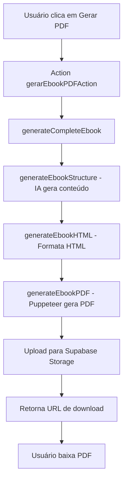

# 📚 Configuração do Gerador de Ebook PDF

Este documento explica como configurar e usar a funcionalidade de geração automática de ebooks em PDF de 30 páginas.

## 🚀 Funcionalidades

- ✅ **Geração automática** de ebooks de 30 páginas
- ✅ **Conteúdo personalizado** baseado no produto criado
- ✅ **Design profissional** com formatação adequada
- ✅ **Download direto** via Supabase Storage
- ✅ **Integração completa** com o fluxo existente

## 📋 Pré-requisitos

### 1. Dependências
```bash
pnpm install puppeteer
```

### 2. Configuração do Supabase Storage

1. **Acesse o Supabase Dashboard**
2. **Vá para Storage**
3. **Execute o script SQL** em `scripts/setup-supabase-storage.sql`

Ou execute manualmente:
```sql
-- Criar bucket para ebooks
INSERT INTO storage.buckets (id, name, public)
VALUES ('ebooks', 'ebooks', true)
ON CONFLICT (id) DO NOTHING;

-- Configurar política de leitura pública
CREATE POLICY "Public read access for ebooks" ON storage.objects
FOR SELECT USING (bucket_id = 'ebooks');
```

### 3. Variáveis de Ambiente

Certifique-se de que estas variáveis estão configuradas:
```env
NEXT_PUBLIC_SUPABASE_URL=sua_url_supabase
NEXT_PUBLIC_SUPABASE_ANON_KEY=sua_chave_anonima
OPENAI_API_KEY=sua_chave_openai
```

## 🎯 Como Usar

### 1. **Gerar Produto**
- Acesse a página de criação de produto principal
- Gere os detalhes do produto normalmente

### 2. **Gerar Ebook PDF**
- Clique no botão **"Gerar Ebook PDF (30 páginas)"**
- Aguarde a geração (pode levar 30-60 segundos)
- Clique em **"Baixar PDF"** quando pronto

### 3. **Estrutura do Ebook Gerado**

O ebook terá:
- **Capa profissional** com título e autor
- **Introdução** (2 páginas)
- **7 Capítulos** (3-4 páginas cada)
- **Conclusão** (2 páginas)
- **Total: 30 páginas**

## 🔧 Arquivos Modificados/Criados

### Novos Arquivos:
- `lib/pdf-generator.ts` - Serviço de geração de PDF
- `app/api/ebook/generate/route.ts` - API para geração
- `scripts/setup-supabase-storage.sql` - Configuração do storage

### Arquivos Modificados:
- `package.json` - Adicionado Puppeteer
- `lib/actions/geracao-actions.ts` - Nova action para PDF
- `app/criar/produto-principal/page.tsx` - Interface do usuário

## 📊 Fluxo de Geração



## 🎨 Personalização

### Modificar Design do PDF
Edite o CSS em `lib/pdf-generator.ts` na função `generateEbookHTML()`:

```typescript
// Personalizar cores, fontes, layout
.cover-title {
    font-size: 2.5em;
    color: #2c3e50; // Altere a cor
}
```

### Ajustar Estrutura do Conteúdo
Modifique o prompt em `generateEbookStructure()`:

```typescript
const prompt = `Crie a estrutura completa de um ebook de 30 páginas...
// Adicione suas diretrizes específicas aqui
`;
```

## 🐛 Troubleshooting

### Erro: "Puppeteer não encontrado"
```bash
pnpm install puppeteer
```

### Erro: "Bucket 'ebooks' não existe"
Execute o script SQL de configuração do Supabase.

### Erro: "Falha ao gerar estrutura"
Verifique se a `OPENAI_API_KEY` está configurada corretamente.

### PDF com formatação incorreta
Verifique o CSS no `generateEbookHTML()` e ajuste conforme necessário.

## 📈 Melhorias Futuras

- [ ] **Templates personalizáveis** de design
- [ ] **Múltiplos formatos** (EPUB, MOBI)
- [ ] **Imagens automáticas** geradas por IA
- [ ] **Índice automático** com links
- [ ] **Marca d'água** personalizada
- [ ] **Compressão de PDF** para arquivos menores

## 🔒 Segurança

- ✅ **URLs públicas** para download direto
- ✅ **Validação de entrada** em todas as APIs
- ✅ **Tratamento de erros** robusto
- ✅ **Logs detalhados** para debugging

## 📞 Suporte

Se encontrar problemas:
1. Verifique os logs do console
2. Confirme as variáveis de ambiente
3. Teste a configuração do Supabase Storage
4. Verifique se o Puppeteer está instalado corretamente
